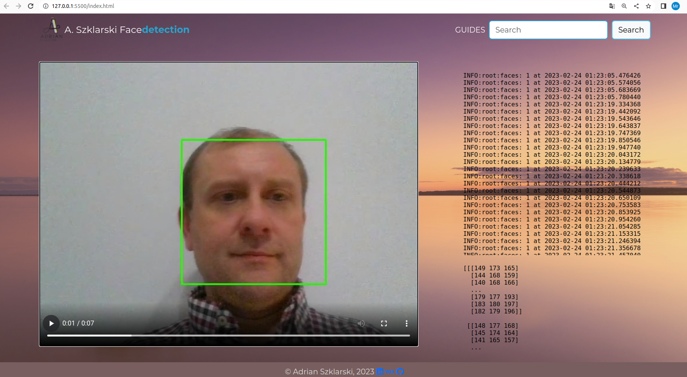

# Face Detection/ Finished project 

Face detection is a computer technology used in many applications that identifies human faces in digital images. Face detection also refers to the psychological process by which humans locate and pay attention to faces in a visual scene. The program demonstrates face detection, and performs analysis which is presented on the website. 

In the application, I wrote the **'Backend'** as well as the **'Frontend'** code on my own using appropriate programming libraries. 

## Created by Adrian Szklarski, 02.2023

 

 

